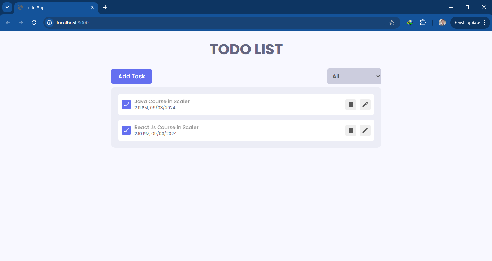

# React-ToDo-Manager

A simple yet powerful to-do list application built with React.js. This project allows users to efficiently manage their tasks with features like adding, editing, and deleting items. The application is designed with a clean and modern UI to enhance user experience, making task management seamless and enjoyable.

## Features

- **Add Tasks**: Quickly add new tasks to your to-do list.
- **Edit Tasks**: Modify existing tasks with real-time updates.
- **Delete Tasks**: Remove completed or unnecessary tasks.
- **Responsive Design**: The application is fully responsive and works across desktops, tablets, and mobile devices.

## Demo



## Live Preview

Check out the live preview of the application [here](https://prem021.github.io/React-ToDo-Manager).

## Getting Started

Follow these instructions to set up and run the project on your local machine.

### Prerequisites

Make sure you have the following installed:

- [Node.js](https://nodejs.org/) (v14 or higher)
- [npm](https://www.npmjs.com/) or [Yarn](https://yarnpkg.com/)

### Installation

1. **Clone the repository**:

   ```bash
   git clone https://github.com/yourusername/React-ToDo-Manager.git

   ```

2. **Navigate to the project directory**:

   ```bash
   cd React-ToDo-Manager
   ```

3. **Install dependencies**:

   ```bash
   npm install
   ```

   or

   ```bash
   yarn install
   ```

4. **Running the Application**

   To start the application in development mode, run:

   ```bash
   npm start
   ```

   or

   ```bash
   yarn start
   ```

   The application will be available at http://localhost:3000.

5. **Building for Production**

   To create an optimized production build, run:

   ```bash
   npm run build
   ```

   or

   ```bash
   yarn build
   ```

   The `build` folder will contain the optimized application ready for deployment.

## Contributing

Contributions are welcome! Please feel free to submit a pull request, open an issue, or fork the repository and improve the codebase.

## License

This project is licensed under the MIT License - see the [LICENSE](LICENSE) file for details.

## Contact

For any inquiries or feedback, please reach out to me via iamprem021@gmail.com.
